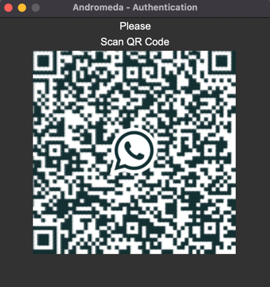
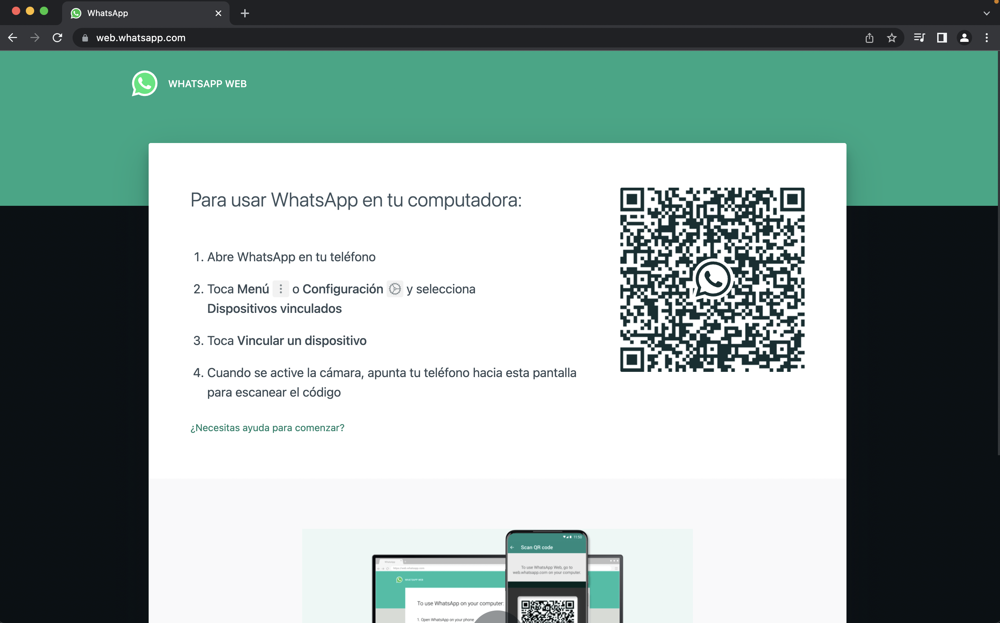

## Install Andromeda - WhatsApp Bot

**Note:** Si quieres leer esta guía en español, puedes hacerlo [aquí](Spanish/Installation.md).


### 📋 Table of Contents

* [Requirements](#requirements)
* [Compatible Browsers](#browsers)
* [Installation](#installation)
    * [Executables](#ExecutableInstallation)
    * [Manual Installation](#ManualInstallation)
    * Docker (deprecated)
    * Installer (deprecated)
    * Windows Installer (deprecated)
* [Starting the Bot](#init)
    * [Executables](#ExeInit)
    * [Manual Installation](#ManualInit)

## <a name="requirements"></a> 📝 Requirements

Compatibility with operating systems:

- Linux
- Mac OS
- Windows 10/11

You need to have the following programs installed:

- Git
- Python 3.8 or higher
- Google Chrome or Microsoft Edge

## <a name="browsers"></a> 🌐 Compatible Browsers

Currently, the bot is compatible with the following browsers:

- Google Chrome 98 or later
- Microsoft Edge 115 or later

Compatibility with Firefox is experimental, and some issues have been found. Support for Firefox will be added in future versions.

## <a name="installation"></a> 💻 Installation

### <a name="ExecutableInstallation"></a> 📦 Executables (Beta)

We continue to work on simplifying the use of Andromeda, so we have created executables for various operating systems. These executables are in beta, so they may contain errors or not work correctly.

1. To download the executables, go to the [GitHub Release section](https://github.com/DiegoDG-01/Whatsapp_BOT/releases) (Executable versions are available from version 0.4.0 onwards).


2. Download and extract the executable for your operating system.


3. Access the **"SRC/Data/Config/Lang"** folder. This folder contains language files (currently only in Spanish and English). Copy the **Codes.json** and **Config.json** files from the language you want to use and paste them into the **"SRC/Data/Config"** folder.

     ```
     SRC/Data/Config/Codes.json
     SRC/Data/Config/Config.json
     ```

4. Open the **"SRC/Data/Config/Config.json"** file and go to the **"Default"** section. Replace the value of **"WhatsappName"** with the name of the chat you want to use for the bot to listen for commands.

    ```
    "Default": {
            "WhatsappName":"MyChat",
            "WhatsappNumber":"",
            "WhatsappGroupName":""
        }
    ```

5. By default, the browser to use is **Google Chrome**. If you want to use Microsoft Edge or another browser, go to the project's root and open the **.env** file. Replace the value of **"DefaultBrowser"** with the name of the browser you want to use (**chrome** or **edge**).


6. In the same **.env** file, make sure to set the language according to the language you selected in step 3 (**Spanish** or **English**).

### <a name="ManualInstallation"></a> 👋🏼 Manual Installation

To manually install the bot, follow these steps:

1. Download the latest version of the bot from [GitHub Release](https://github.com/DiegoDG-01/Whatsapp_BOT/releases) or use **Git** in your terminal:
    ```
    git clone "https://github.com/DiegoDG-01/Andromeda-Whatsapp_BOT.git"
    ```

2. Copy the downloaded folder to the directory of your choice.


3. Access the project folder from the terminal:
    ```
    cd Chosen-Path/Andromeda-Whatsapp_BOT
    ```

4. (**Optional**) Install the package for creating Python virtual environments:
    ```
    pip3 install virtualenv
    ```

5. (**Optional**) Create the virtual environment:
    ```
    virtualenv -p python3 .venv
    ```

6. (**Optional**) Activate the virtual environment:

    **Unix/Linux:**
    ```
    source .venv/bin/activate
    ```

    **Windows:**
    ```
    .venv\\Scripts\\activate.bat
    ```

7. Once inside the bot's folder, execute the following command to install the dependencies:
    ```
    python3 pip install -r requirements.txt
    ```

8. (**Optional for Unix/Linux**) Execute the following command if you want to create an alias for easier bot execution from the terminal:

    **If using bash:**
    ```
    echo 'alias andromeda="cd /Chosen-Path/Andromeda-Whatsapp_BOT/SRC/ && source .venv/bin/activate && python3 entrypoint.py"' >> ~/.bashrc
    ```

    **If using zsh:**
    ```
    echo 'alias andromeda="cd /Chosen-Path/Andromeda-Whatsapp_BOT/SRC/ && source .venv/bin/activate && python3 entrypoint.py"' >> ~/.zshrc
    ```

   Replace **"Chosen-Path"** with the path where the project folder is located.


9. (**obligatory**) Access the **"SRC/Data/Config/Lang"** folder. This folder contains language files (currently only in Spanish and English). Copy the **Codes.json** and **Config.json** files from the language you want to use and paste them into the **"SRC/Data/Config"** folder.

     ```
     SRC/Data/Config/Codes.json
     SRC/Data/Config/Config.json
     ```

10. (**obligatory**) Open the **"SRC/Data/Config/Config.json"** file and go to the **"Default"** section. Replace the value of **"WhatsappName"** with the name of the chat you want to use for the bot to listen for commands.

    ```
    "Default": {
            "WhatsappName":"MyChat",
            "WhatsappNumber":"",
            "WhatsappGroupName":""
        }
    ```

11. By default, the browser to use is **Google Chrome**. If you want to use Microsoft Edge or another browser, go to the project's root and open the **.env** file. Replace the value of **"DefaultBrowser"** with the name of the browser you want to use (**chrome** or **edge**).


12. In the same **.env** file, make sure to set the language according to the language you selected in step 3 (**Spanish** or **English**).


13. Go to the [Start Bot](#init) section.

## 😎 Starting the Bot <a name="init"></a>

### <a name="ExeInit"></a> ⚙️ Executables (Beta)

If you downloaded the executable for your operating system, simply run the **"Andromeda"** file and scan the QR code with your phone to wait for the bot to log in.

Windows and Linux:



Mac OS:



**Note:** If you use Mac OS, the QR code will be displayed in the terminal due to an issue that is being resolved. Support for Mac OS will be added in future versions.

### <a name="ManualInit"></a> 📝 Start the Bot Manually

1. From the terminal, navigate to the **"SRC"** folder of the project:

    **Unix/Linux:**
    ```
    cd Chosen-Path/Andromeda-Whatsapp_BOT/SRC/
    ```

    **Windows:**
    ```
    cd Chosen-Path\Andromeda-Whatsapp_BOT\SRC\
    ```

   Replace **"Chosen-Path"** with the path where the project folder is located.


2. Execute the following command to start the bot:

    ```
    python3 entrypoint.py
    ```

3. Scan the QR code with your phone and wait for the bot to log in.

Windows and Linux:


Mac OS:


**Note:** If you use Mac OS, the QR code will be displayed in the terminal due to an issue that is being resolved. Support for Mac OS will be added in future versions.

