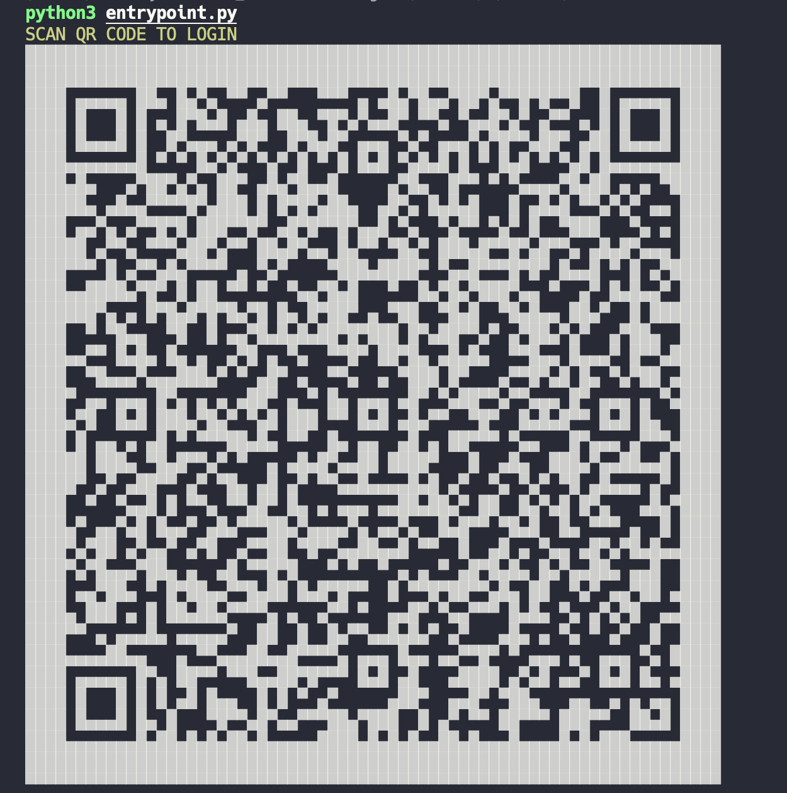

## Install Andromeda - WhatsApp Bot

Currently, this bot is testing in the MacOS and Linux function and the installer only on these operating systems, but it will be updated in the future or can be installed manually following instructions.

## 📕 Requirements

Currently, the bot is compatible with the next's operating systems:

- Linux (APT package manager required)
- Mac OS Big Sur or later (Brew Package Manager)

You're need have installed the next's software programs:

- Git
- Python 3.X 
- Google Chrome

Please note that the bot is not tested in Windows or Windows WSL

## 🌐 Supported Browsers

Currently, the bot is tested in the following browsers:

 - Google Chrome 98.X

## 💻 Install

### Using the installer

1. Download the latest version of the bot from the [GitHub Release](https://github.com/DiegoDG-01/Whatsapp_BOT/releases) or using **Git** in your terminal:
    ```
    git clone "https://github.com/DiegoDG-01/Andromeda-Whatsapp_BOT.git"
    ```
2. In your terminal open the folder with the bot and run the following command:
    ```
    python3 install.py
    ```
    The installation show progress and important information, please wait until the installation is finished.


3. The installer will request the name chat to used for listen the messages (it's recommend create previously one group with **only you**).


5. The installer will create a new folder with the name "Andromeda-Whatsapp_BOT" in your home directory.


6. **Download** and **install** ChromeDriver from the [ChromeDriver website](https://chromedriver.chromium.org/downloads) according your Google Chrome version.

### Manual installation

if you don't want to use the installer.

1. you can download the latest version of the bot from the [GitHub Release](https://github.com/DiegoDG-01/Whatsapp_BOT/releases) or using **Git** in your terminal:
    ```
    git clone "https://github.com/DiegoDG-01/Andromeda-Whatsapp_BOT.git"
    ```
2. Copy the folder with the bot to desired location.


3. (Optional) Install virtual environment
    ```
    pip3 install virtualenv
    ```
   
4. (Optional) Open the folder with the bot and run the following command to create a virtual environment:
    ```
    virtualenv -p python3 .venv
    ```
   
5. (Optional) Activate the virtual environment:
    ```
    source .venv/bin/activate
    ```

6. under the folder with the bot, run the following command to install the dependencies:
    ```
    python3 pip install -r requirements.txt
    ```

7. **Download** and **install** ChromeDriver from the [ChromeDriver website](https://chromedriver.chromium.org/downloads) according your Google Chrome version.


8. (Optional) In the terminal, run the following command to create alias for the executable easy access,
    "CHOSEN_PATH" is the path selected by you in the step 2.
    <br>
    <br>
    if you use Bash:
    ```
    echo 'alias andromeda="cd CHOSEN_PATH/SRC/ && source .venv/bin/activate && python3 entrypoint.py"' >> ~/.bashrc
    ```
    
    if you use ZSH:
    ```
    echo 'alias andromeda="cd CHOSEN_PATH/SRC/ && source .venv/bin/activate && python3 entrypoint.py"' >> ~/.zshrc
    ```
   
9. (**Obligatory**) access to folder **"SRC/Data/Config/Lang"** this folder contains the language files (currently only **English** and **Spanish**) copy ***Codes.json*** and ***Config.json*** and paste them in the root folder **"SRC/Data/Config"**. 
    ```
    SRC/Data/Config/Codes.json
    SRC/Data/Config/Config.json
    ```
   
10. (**Obligatory**) Open the file **"SRC/Data/Config/Config.json"** and search and replace the value of "**WhatsappName**" this value is name of chat that the bot is reading.
    ```
    "Default": {
            "WhatsappName":"(CHOSEN_NAME)"
            "WhatsappNumber":"",
            "WhatsappGroupName":""
        }
    ```

## 😎 Initialization

To start the bot, run the next command:

if you created alias for the executable (installer created alias):
```
ANDROMEDA
```

if you didn't create alias ("CHOSEN_PATH" is the path selected by you in Install the step 2)
```
python3 CHOSEN_PATH/SRC/entrypoint.py
```

Once started, show the initial page of whatsapp web, its necessary scan QR Code with the whatsapp app in your phone.



Once scanned, the bot will be started and ready to listen messages.